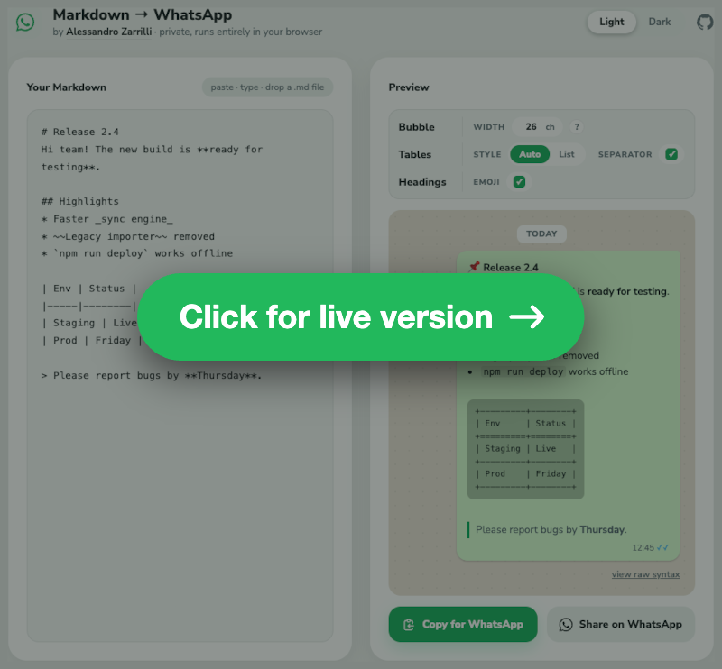

# Markdown to WhatsApp Converter

[](https://opensource.org/licenses/MIT)
[](https://github.com/drsound/markdown-to-whatsapp)

A client-side web utility to convert standard Markdown into WhatsApp's formatting syntax.

**[➡️ Go to the Live Tool](https://drsound.github.io/markdown-to-whatsapp/)**

[](https://drsound.github.io/markdown-to-whatsapp/)

---

## Purpose of this Tool

WhatsApp uses a non-standard syntax for text formatting (e.g., `*bold*`, `_italic_`, `~strikethrough~`). This is similar, but not identical, to standard Markdown.

This tool provides a simple way to convert text from Markdown sources (like text editors, Google Docs, etc.) into the format that WhatsApp expects, saving the need for manual correction.

The entire conversion process runs locally in your browser using JavaScript. **No data is ever sent to a server.**

## Supported Conversions

The script uses the [marked](https://github.com/markedjs/marked) library for proper AST-based parsing and handles:

### Text Styles
* **Bold:** `**text**` → `*text*`
* **Italic:** `*text*` or `_text_` → `_text_`
* **Strikethrough:** `~~text~~` → `~text~`
* **Inline code:** `` `code` `` → `` `code` ``
* **Bold+Italic:** `***text***` → `_*text*_` (preserves both styles)

### Headers
Headers are converted to bold text with level-specific emoji prefixes:
* `# H1` → `*📌 H1*`
* `## H2` → `*🟠 H2*`
* `### H3` → `*🟡 H3*`
* And so on...

The emoji prefix can be turned off in the UI ("Emoji prefix in headings"), leaving plain `*Title*`.

### Lists
* **Unordered lists:** Uses `*` prefix with `◦` for nested levels
  * Level 1: `* Item`
  * Level 2: `* ◦ Item`
  * Level 3: `* ◦ ◦ Item`
* **Ordered lists:** Preserves numbering, with `◦` marking nested levels
  * `1. A` / `◦ 1. A1` / `◦ ◦ 1. A1a` / `2. B`
* **Task lists:** `- [x]` → `☑`, `- [ ]` → `☐`, also inside ordered lists (`1. ☑ done`)
* **Loose items:** multiple paragraphs of one item are joined on a single line
* **Block content in items:** code blocks, blockquotes and nested lists are emitted on their own lines below the item

### Tables
The converter supports **three strategies** for table rendering, selectable via the UI:

1. **ASCII Table**
   Standard responsive ASCII art inside monospace blocks.
   ```
   +--------+-------------+
   | Name   | Description |
   +========+=============+
   | Value  | Details     |
   +--------+-------------+
   ```

2. **Bulleted List**
   Converts the table into a nested list. The converter **automatically detects** the table orientation:

   * **Key-Value tables** (2 columns with generic headers like "Attribute/Value"):
     ```
     * *CPU:* Intel Xeon
     * *RAM:* 64 GB
     * *Storage:* 1 TB SSD
     ```
   
   * **Horizontal tables** (first column cells are bold = parameters):
     ```
     * *Proxmox*
     * ◦ _Kernel:_ KVM
     * ◦ _License:_ AGPL v3
     * *ESXi*
     * ◦ _Kernel:_ VMkernel
     * ◦ _License:_ Proprietary
     ```
   
   * **Vertical tables** (standard row-based, 3+ columns):
     ```
     * *Product:* Laptop
     * ◦ _Price:_ $999
     * ◦ _Stock:_ 50
     * *Product:* Smartphone
     * ◦ _Price:_ $599
     * ◦ _Stock:_ 100
     ```
   
   Key-Value detection supports **11 languages**: English, Italian, Spanish, French, Portuguese, German, Russian, Arabic, Hindi, Bengali, and Indonesian.

3. **Auto (Smart Switch)**
   Degrades progressively until the table fits the configurable limit (default **26 chars**):
   1. Full ASCII box, removing padding column by column (right-side first, then left-side).
   2. **Compact borderless** style, again removing padding progressively:
      ```
       Head1|Head2       |Head-N
      ------+------------+------
       A    |BBBBBBBBBBBB|C
      ```
   3. **Wrapped compact** style: each column gets at least its longest word, the
      remaining width is shared proportionally and cells are word-wrapped.
   4. **Bulleted List**, when not even the longest words fit.

**Additional table behaviour**
* Column widths are measured in display cells, so emoji and CJK text stay aligned (`✅`, `日本語` count as two columns).
* Column alignment (`:---`, `:---:`, `---:`) is honoured in the box and compact styles.
* Header-only tables render without an empty body or a doubled border.
* `<br>` inside a cell becomes a space, and an escaped `\|` becomes `∣` so it cannot fake an extra column.
* **Border style** defaults to Unicode box drawing (`┌───┐`); ASCII (`+---+`) can be chosen in the UI, where the control appears in ASCII table mode.

### Other Elements
* **Links:** `[text](url)` → `text (url)`; autolinks, `<https://x>`, `[url](url)` and `<me@x.com>` render as the bare URL or address (no duplication, no `mailto:` leak)
* **HTML entities:** decimal and hexadecimal references plus the common named ones — Latin-1 letters, punctuation and symbols (`caf&eacute;` → `café`, `&copy;` → `©`, `&#65;` → `A`). Rarer references (Greek, mathematical) are left as written.
* **Inline HTML:** `<b>`/`<strong>` → `*`, `<i>`/`<em>` → `_`, `<s>`/`<del>` → `~`, `<code>` → `` ` ``, `<br>` → newline; comments and other tags are stripped
* **HTML blocks:** tags removed, block boundaries turned into newlines, entities decoded
* **Blockquotes:** Preserves `>` prefix, supports nesting (`> > nested`)
* **Code blocks:** Preserved with triple backticks; a triple backtick inside the content is replaced with `ˋˋˋ` so it cannot close the block early
* **Horizontal rules:** `---` → `───────────────`
* **Escape characters:** Uses Unicode look-alikes (`∗`, `＿`, `∼`) so WhatsApp won't interpret them as formatting

### WhatsApp-Specific Handling
* **Partial-word formatting is ignored:** `super**bold**ly` → `superboldly` (WhatsApp doesn't support mid-word formatting)
* **Punctuation is a valid boundary:** `**Name**: value` → `*Name*: value`, and so are `(**x**)` and `**end**.`
* **No post-processing:** Clean AST-based conversion without regex hacks

## How to Use

1.  **Open the web page:** [https://drsound.github.io/markdown-to-whatsapp/](https://drsound.github.io/markdown-to-whatsapp/)
2.  **Paste, type or drop a `.md` file** into the left panel. "Try an example" fills it with a sample message.
3.  The right panel shows the message **in a WhatsApp bubble**, exactly as the recipient will see it; "view raw syntax" shows the text that will be copied.
4.  **"Copy for WhatsApp"**, or **"Share on WhatsApp"** to open a chat with the message ready via `wa.me`.

The interface follows the **operating system's light or dark theme**; the header toggle
overrides it and that choice is remembered.
Conversion options appear only when they apply — the table controls when the text contains a
table, the heading-emoji toggle when it contains a heading, the border style in ASCII table
mode — and are stored in `localStorage` along with the theme.

## Development

### Running Tests

```bash
cd tests
npm install
npm test
```

The test suite uses file-based testing:
* `tests/inputs/*.md` - Markdown input files
* `tests/inputs/*.json` - optional per-fixture converter options (e.g. `{ "tableFormat": "ascii" }`)
* `tests/expected/*.txt` - Expected WhatsApp output

Tests also run in CI on every push and pull request (`.github/workflows/test.yml`).

### Project Structure

* `docs/converter.js` - the converter itself: pure, DOM-free, options passed as a parameter
* `docs/ui.js` - page wiring: theme, contextual options, WhatsApp preview, copy and share
* `docs/index.html`, `docs/style.css` - markup and hand-written stylesheet (no CSS framework)

The [marked](https://github.com/markedjs/marked) version is pinned to **18.0.10** in both
`docs/index.html` (with an SRI hash) and `tests/package.json`, so the page and the tests
always parse Markdown the same way.

### Local Development

```bash
cd docs
python3 -m http.server 8080
# Open http://localhost:8080
```