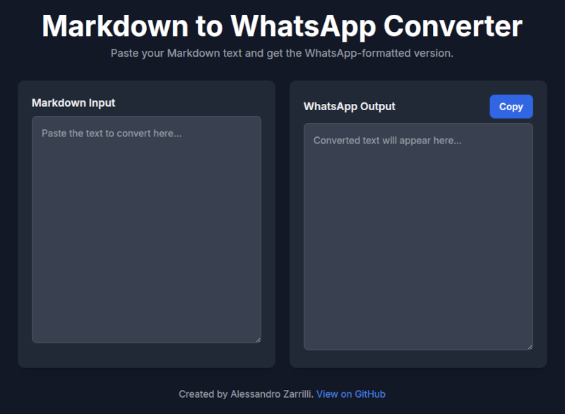

# Markdown to WhatsApp Converter

[](https://opensource.org/licenses/MIT)
[](https://github.com/drsound/markdown-to-whatsapp)

A client-side web utility to convert standard Markdown into WhatsApp's formatting syntax.

**[➡️ Go to the Live Tool](https://drsound.github.io/markdown-to-whatsapp/)**



---

## Purpose of this Tool

WhatsApp uses a non-standard syntax for text formatting (e.g., `*bold*`, `_italic_`, `~strikethrough~`). This is similar, but not identical, to standard Markdown.

This tool provides a simple way to convert text from Markdown sources (like text editors, Google Docs, etc.) into the format that WhatsApp expects, saving the need for manual correction.

The entire conversion process runs locally in your browser using JavaScript. **No data is ever sent to a server.**

## Supported Conversions

The script uses the [marked](https://github.com/markedjs/marked) library for proper AST-based parsing and handles:

### Text Styles
* **Bold:** `**text**` → `*text*`
* **Italic:** `*text*` or `_text_` → `_text_`
* **Strikethrough:** `~~text~~` → `~text~`
* **Inline code:** `` `code` `` → `` `code` ``
* **Bold+Italic:** `***text***` → `*text*` (uses bold only to avoid underscore visibility issues)

### Headers
Headers are converted to bold text with level-specific emoji prefixes:
* `# H1` → `*📌 H1*`
* `## H2` → `*🟠 H2*`
* `### H3` → `*🟡 H3*`
* And so on...

### Lists
* **Unordered lists:** Uses `*` prefix with `◦` for nested levels
  * Level 1: `* Item`
  * Level 2: `* ◦ Item`
  * Level 3: `* ◦ ◦ Item`
* **Ordered lists:** Preserves numbering (`1.`, `2.`, etc.)
* **Task lists:** `- [x]` → `☑`, `- [ ]` → `☐`

### Tables
Tables are rendered as ASCII art inside monospace blocks:
```
+--------+-------------+
| Name   | Description |
+========+=============+
| Value  | Details     |
+--------+-------------+
```

### Other Elements
* **Links:** `[text](url)` → `text (url)`
* **Blockquotes:** Preserves `>` prefix, supports nesting (`> > nested`)
* **Code blocks:** Preserved with triple backticks
* **Horizontal rules:** `---` → `───────────────`
* **Escape characters:** Uses Unicode look-alikes (`∗`, `＿`, `∼`) so WhatsApp won't interpret them as formatting

### WhatsApp-Specific Handling
* **Partial-word formatting is ignored:** `super**bold**ly` → `superboldly` (WhatsApp doesn't support mid-word formatting)
* **No post-processing:** Clean AST-based conversion without regex hacks

## How to Use

1.  **Open the web page:** [https://drsound.github.io/markdown-to-whatsapp/](https://drsound.github.io/markdown-to-whatsapp/)
2.  **Paste your text** into the left panel.
3.  **Copy the result** from the right panel using the "Copy" button.
4.  **Paste** the formatted text into your WhatsApp chat.

## Development

### Running Tests

```bash
cd tests
npm install
npm test
```

The test suite uses file-based testing:
* `tests/inputs/*.md` - Markdown input files
* `tests/expected/*.txt` - Expected WhatsApp output

### Local Development

```bash
cd docs
python3 -m http.server 8080
# Open http://localhost:8080
```